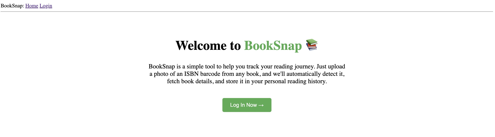

# 📚 BookSnap

BookSnap is a Flask web app that lets you upload images of ISBN barcodes from books. It detects the ISBN, fetches book details using the Google Books API, and saves your personal search history.

---

## 🚀 Features

- 📷 Upload book cover images with ISBN barcodes
- 🔍 Automatically detect ISBN and retrieve book info (title, author, description, cover, etc.)
- 🧾 Log and display your 10 most recent book searches
- 👤 User authentication and profile management
- 🧼 Clear your search history with one click

---

## 💻 Tech Stack

- **Python 3**
- **Flask**
- **SQLite** 
- **Pyzbar** 

---

## 🛠️ Setup Instructions

1. **Clone the repo**
   
2. **Create a virtual environment**
```bash
python3 -m venv .venv
source .venv/bin/activate
```
3. **Create a virtual environment**
```bash
pip install -r requirements.txt
```
4. **Set up environment variables Create a .env file with the following:**
```bash
FLASK_APP=app
FLASK_ENV=development
SECRET_KEY=you-will-never-guess
```
5. **Run the app**
```bash
flask run
```
6. **Upgrade database(optional)**
```bash
flask db migrate -m "Add notes of changes in fields"
flask db upgrade
```

## License
This project was inspired by Miguel Grinberg’s Flask Mega-Tutorial, which is an excellent guide to learning Flask. Some parts of the structure and code style were adapted for educational purposes.

[MIT](https://choosealicense.com/licenses/mit/)


